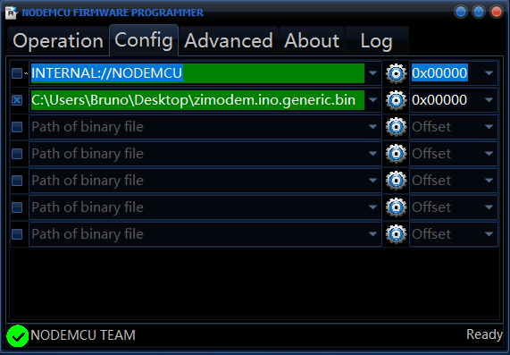
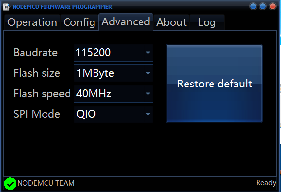
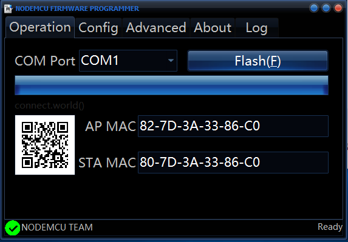

# Firmware

**Online update**

If the modem is working you can upgrade the firmare directly online: just check if there is a new release available with the command AT&U and, if there is type in the command AT&U6502.
Wait a couple of minutes and the modem will update itself to the latest firmware available.

**Arduino or PortIO**

You can update the firmware from sources using Arduino or PortIO: The only supported version of Arduino is rev 1.6.11. Download the sources from GitHub, install the ESP8266 board manager, select the ESP8266 generic board, unplug the modem power supply, and plug it again while keeping pressed the reset button on the modem.

**ESP8266 **

This method is the simplest one: you need a Windows computer, the software [NodeMCU Flasher](https://github.com/nodemcu/nodemcu-flasher) and the precompiled [firmware](https://github.com/8bit-bruno/WiFiModem/firmware/zimodem.ino.generic.bin).

Step 1

Run NodeMCU Flasher, click on the Config tab than the gear on the left of a blank line, select the firmware previously downloaded.

Step 2

Advanced tab: these are the correct parameters 

Step 3

Operation tab: select the com port and then click on flash. The firmware will be loaded on the modem. After the confirm of the operation you can close the NodeMCU Flasher and reset the modem (disconnecting the usb power cable). The modem is ready!